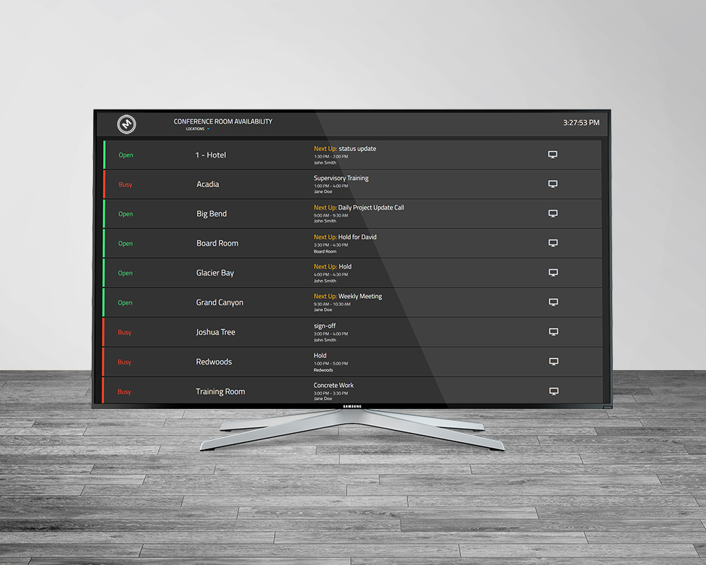
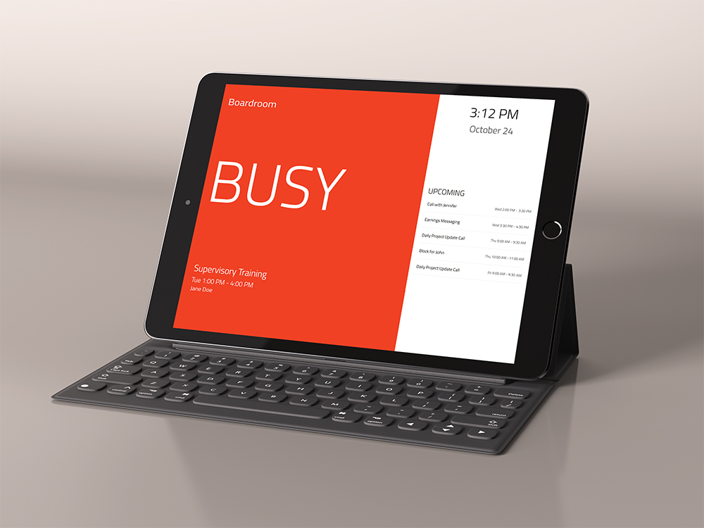

# MeetEasier

MeetEasier zeigt die Verfügbarkeit von Besprechungsräumen aus Exchange Web
Services (EWS) als gemeinsames Flightboard oder als Einzelraumanzeige an. Eine
Einzelraumanzeige kann ihren aktuellen Zustand zusätzlich für den lokalen
Room-LED-Dienst bereitstellen.


Dieses Repository ist eine modernisierte Weiterentwicklung von
[danxfisher/MeetEasier](https://github.com/danxfisher/MeetEasier). Es behält
die ursprüngliche GPL-3.0-Lizenz bei und ergänzt unter anderem aktuelle
Node.js-, React-, Vite-, Socket.IO- und EWS-Abhängigkeiten sowie einen
optionalen Raspberry-Pi-LED-Dienst.

## Voraussetzungen

- Node.js 24 und npm 11
- ein per HTTPS erreichbarer EWS-Endpunkt
- Exchange-Raumpostfächer, die in Raumlisten organisiert sind
- ein Dienstkonto mit Leseberechtigung für diese Raumkalender

Die EWS-Anmeldung erfolgt per NTLM. Das HTTPS-Zertifikat des konfigurierten
EWS-Endpunkts wird regulär geprüft.

## Installation

Abhängigkeiten installieren, Produktionsdateien erzeugen und die Auslieferung
prüfen:

```sh
cp .env.template .env
npm ci
npm run verify:production
```

Vor dem Start müssen die Zugangsdaten und der EWS-Endpunkt in `.env` gesetzt
sein. Die Datei ist von Git ausgeschlossen und darf nicht eingecheckt werden.

Die Anwendung lässt sich anschließend direkt starten:

```sh
npm start
```

Standardmäßig lauscht sie auf Port 8080. Im produktiven Raspberry-Pi-Betrieb
wird `server.js` durch PM2 gestartet; die Prozessdefinition muss dabei das
Repository als Arbeitsverzeichnis und `/usr/bin/node` als Interpreter
verwenden.

## Konfiguration

Die verfügbaren Umgebungsvariablen stehen in [.env.template](.env.template):

| Variable | Bedeutung |
| --- | --- |
| `EXCHANGE_USER` | Benutzername des EWS-Dienstkontos |
| `EXCHANGE_PASS` | Passwort des EWS-Dienstkontos |
| `EXCHANGE_DOMAIN` | NTLM-Domäne des Dienstkontos |
| `EXCHANGE_URL` | vollständige HTTPS-URL des EWS-Endpunkts |
| `EWS_TIMEOUT_MS` | Zeitlimit eines EWS-Aufrufs; Standard: 15000 ms |
| `EWS_POLL_INTERVAL_MS` | Abstand zwischen erfolgreichen Abfragen; Standard: 60000 ms |
| `DISPLAY_ROOM_ALIAS` | Alias der lokalen Einzelraumanzeige; leer deaktiviert die LED-Statusdatei |
| `LED_STATE_FILE` | Pfad der atomar geschriebenen LED-Statusdatei |
| `PORT` | HTTP-Port der Anwendung; Standard: 8080 |

Räume können in [config/room-blacklist.js](config/room-blacklist.js) anhand
ihrer E-Mail-Adresse ausgeschlossen werden:

```js
module.exports = [
  'room@example.com'
];
```

Texte der Benutzeroberfläche liegen in
`ui-react/src/config/flightboard.config.js` und
`ui-react/src/config/singleRoom.config.js`. Das Flightboard-Logo wird aus
`static/img/logo.png` geladen.

## Ansichten und API

- `/` – Flightboard aller Räume
- `/single-room/<room-alias>` – Anzeige eines einzelnen Raums
- `/api/heartbeat` – einfacher Verfügbarkeitscheck
- `/api/rooms` – Räume einschließlich Kalender- und Belegungsdaten
- `/api/roomlists` – verfügbare Exchange-Raumlisten

Die Browser erhalten Aktualisierungen über Socket.IO. Einzelraumansicht und
Flightboard verwenden denselben Backendprozess.

## Entwicklung und Prüfung

Backend und Frontend werden getrennt getestet:

```sh
npm test
npm --prefix ui-react test
npm run verify:production
```

Für die Frontendentwicklung läuft das Backend weiterhin auf Port 8080. Vite
wird in einem zweiten Terminal gestartet und stellt den Entwicklungsserver auf
Port 3000 bereit:

```sh
npm start-ui-dev
```

Vite leitet API- und Socket.IO-Anfragen an das Backend weiter. Die lokal
gebündelten Foundation- und Titillium-Web-Ressourcen werden vor Start und Build
automatisch vorbereitet.

Die globalen Styles werden aus `scss/compiled.scss` erzeugt:

```sh
npm run build:styles
npm run watch:styles
```

## Verzeichnisstruktur

- `app/` – HTTP-Routen, EWS-Zugriff, Socket.IO-Steuerung und LED-Statuswriter
- `config/` – EWS-Konfiguration und Raum-Blacklist
- `ops/room-led/` – gehärteter LED-Daemon, systemd-Vorlage, Installer und Betriebsanleitung
- `scss/` – Quellen der globalen Styles
- `static/` – direkt ausgelieferte Styles und Bilder
- `test/` – Backend- und Integrationsprüfungen
- `ui-react/` – React-Oberfläche, Vite-Konfiguration und Frontendtests

## Room-LED-Dienst

Installation, Voraussetzungen, Diagnose und die Unterschiede zwischen
libgpiod 1.x und 2.x sind in
[ops/room-led/README.md](ops/room-led/README.md) beschrieben. Der Installer
erkennt den RP1-Chip über sein Label und benötigt keine feste
`gpiochip`-Nummer.

## Ansichten

### Flightboard



### Einzelraum



## Lizenz und Bildnachweise

MeetEasier und diese Weiterentwicklung stehen unter der
[GNU General Public License 3.0](LICENSE). Urheber- und Beitragsinformationen
bleiben zusätzlich über das oben verlinkte ursprüngliche Projekt
nachvollziehbar.

Die Mockup-Vorlagen stammen von Anthony Boyd Graphics und Freepik:

- <https://www.anthonyboyd.graphics/mockups/2017/realistic-ipad-pro-mockup-vol-3/>
- <https://www.freepik.com/free-psd/business-meeting-with-tv-mockup_1163371.htm>
- <https://www.freepik.com/free-psd/samsung-tv-mockup_800771.htm>
